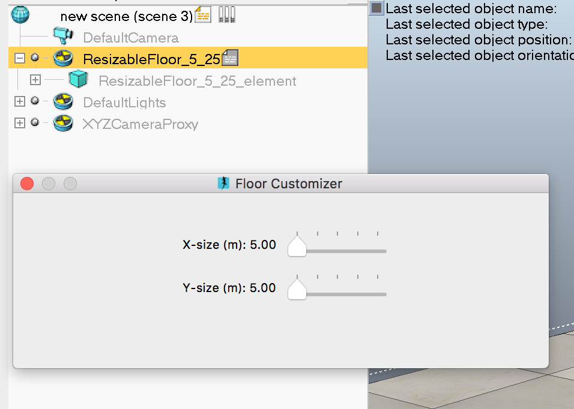
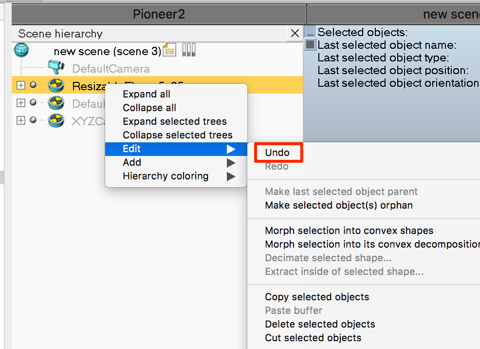

# Floor Resizing

The default scene comes with a resizable grid floor.

To resize the floor simply select the `Resizable_Floor_5_25` object:

and use the sliders to modify the floor size.

__DO NOT__ close the resizing dialogue window when you have finshed changing the floor size. Simply click `ESC` to unselct the object and close the window that way.

If you do close the dialogue using the `X` in the top left corner of the dialogue window, whenever you select the `Resizable_Floor_5_25` object in that scene you *will not* be presented with the resizing tool.

Instead, you will have to undo the delete action, by right clicking on the `Resizable_Floor_5_25` object, then select `Edit -> Undo`.

