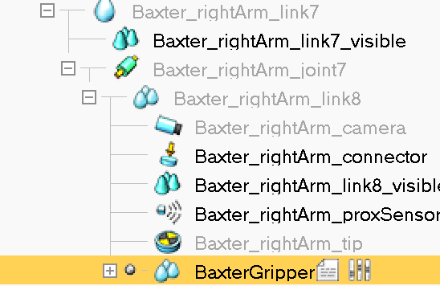
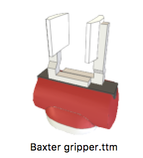
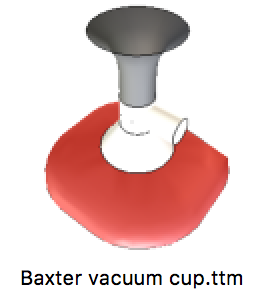

# Working With Baxter VREP Model

Notes on working with the Baxter VREP Model.

### Script Set-Up In the Model / Scene

To contrtol the Baxter model from a Python script via the reote API:

- disable the *Threaded child script*s;
- leave the [*Non-threaded child script (Baxter)*](../luascripts/Non_threaded_child_script_Baxter.lua) enabled (this manages the sensors)

### Enabling Sensors

The sensors are managed via the [*Non-threaded child script (Baxter)*](../luascripts/Non_threaded_child_script_Baxter.lua). Ensure the sensors are enabled as required:

```lua
local headSensorOn=true
local headCameraOn=true
local rightHandSensorsOn=true
local leftHandSensorsOn=true
```

TO CHECK:

To set the variables from a script it looks as if they need setting via a signal? http://www.forum.coppeliarobotics.com/viewtopic.php?f=9&t=4227 http://www.forum.coppeliarobotics.com/viewtopic.php?f=9&t=2695 
 Add this in a threaded script somewhere? But then, how does it relate to var set as local in Unthreaded child script?

### Adding Manipulators

There are two manipulators defined for the Baxter available in the VREP simulator. They can befound in the *Model browser > components > grippers* panel:

- gripper;
- vacuum cup.

To add the manipulators to the Baxter model:

- drag the manipulator model into the scene;
- in the *Scene hierarchy*, drag the manipulator object into the correct place in the hierarchy - for example, to the end of one of Baxter's arms:



- connect the manipulator to the model in the rendered scene:
  - select the manipulator;
  - select the *Object/item shift* option from the toolbar;
  - set the position relative to *Parent frame*.

  
#### Gripper



The gripper relative position setting (*Object/item shift* ) and orientation setting (from *Object/item rotate*) appear to be 0.

#### Vacuum cup



Not sure if I'm doing something wrong here, but the gripper relative position setting (*Object/item shift* ) and orientation setting (from *Object/item rotate*) appear to be not-0:

- relative position: -0.055 in z, +0.002 in y, 0.0015 in x
- relative rotation: -180 degrees in Alpha
